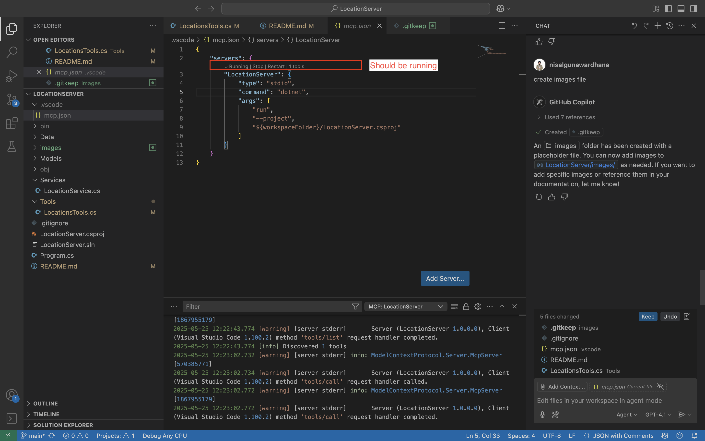
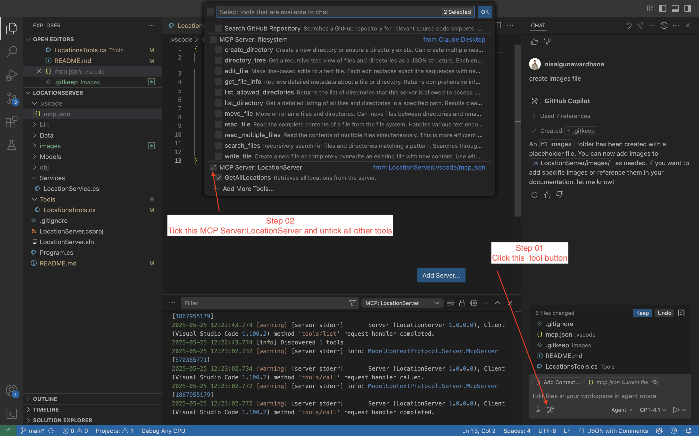

# LocationService MCP Server (Demo)

This project demonstrates a Model Context Protocol (MCP) server for managing locations using .NET 8 and the ModelContextProtocol library.

[](https://github.com/nisalgunawardhana)

---

## Quick Start

### Clone and Run
1. **Clone the repository:**
   ```sh
   git clone https://github.com/nisalgunawardhana/Try-mcp-location-server-demo.git
   cd LocationServer
   ```
2. **Restore dependencies:**
   ```sh
   dotnet restore
   ```
3. **Run the server:**
   ```sh
   dotnet run --project LocationServer.csproj
   ```
4. **(Optional) Use with VS Code Copilot Chat:**
   - Open this folder in VS Code.
   - Ensure `.vscode/mcp.json` exists and is configured (see below).
   -
      - 
      - 

      5. **Start a chat session:**  
         - In Copilot Chat, just type:  
           ```
           Can you retrieve all locations from the server
           ```
         - Copilot Chat will use the MCP tool to fetch all locations.

---

## What is MCP?
**Model Context Protocol (MCP)** is an open protocol for interacting with AI models and tools in a structured, language-agnostic way. MCP enables clients (like VS Code Copilot Chat) to discover, invoke, and interact with server-side tools and models using a standard interface. This makes it easy to build, test, and extend AI-powered tools and services.

### Why MCP?
- **Standardization:** Unified way to expose and consume tools/models.
- **Interoperability:** Works with any MCP-compatible client (e.g., VS Code Copilot Chat).
- **Extensibility:** Add new tools easily by annotating methods/classes.
- **Automation:** Enables advanced workflows and automation in editors and other clients.

---

## Project Structure
- `Models/Location.cs` - Location model
- `Services/LocationService.cs` - Service for managing locations
- `Data/locations.json` - Data file with 50 real locations
- `Tools/LocationsTools.cs` - MCP tools for location operations
- `Program.cs` - Entry point and server setup

---

## Tasks & Tools (Demo)
This demo exposes the following MCP tools for use in Copilot Chat or any MCP client:

1. **GetAllLocations**: Retrieve all locations from the server.
2. **GetLocationById**: (Not yet implemented) Retrieve a location by its ID. You can add this tool by creating a static method in `Tools/LocationsTools.cs` and annotating it with `[McpServerTool]`.
3. **AddLocation**: (Not yet implemented) Add a new location to the server. To enable this, define a static method in `Tools/LocationsTools.cs` and use the `[McpServerTool]` attribute.

---

## Adding More Tools
To add new tools, create static methods in `Tools/LocationsTools.cs` and annotate them with `[McpServerTool]`.

---
## Connect with Me

Follow me on social media for more sessions, tech tips, and giveaways:

- [LinkedIn](https://www.linkedin.com/in/nisalgunawardhana/) — Professional updates and networking
- [Twitter (X)](https://x.com/thenisals) — Insights and announcements
- [Instagram](https://www.instagram.com/thenisals) — Behind-the-scenes and daily tips
- [GitHub](https://github.com/nisalgunawardhana) — Repositories and project updates
- [YouTube](https://www.youtube.com/channel/UCNP5-zR4mN6zkiJ9pVCM-1w) — Video tutorials and sessions

Feel free to connect and stay updated!

---

## License
This project is licensed under the MIT License. See the [LICENSE](LICENSE) file for details.
